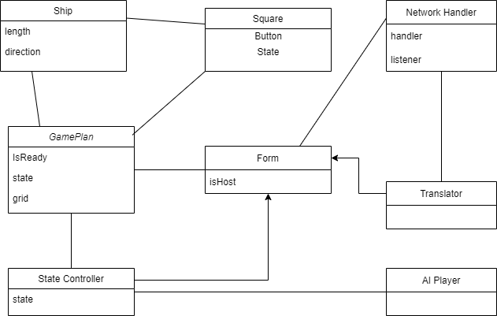

# Ships - Josef Lukášek - Development Documentation I
## Table of Contents
- [Ships - Josef Lukášek - Development Documentation I](#ships---josef-lukášek---development-documentation-i)
  - [Table of Contents](#table-of-contents)
  - [Introduction](#introduction)
  - [Class Diagram](#class-diagram)
  - [Class Descriptions](#class-descriptions)
    - [ShipsForm](#shipsform)
    - [StateController](#statecontroller)
    - [Translator](#translator)
    - [GamePlan](#gameplan)
    - [NetworkHandler](#networkhandler)
    - [AI Player](#ai-player)
    - [Ship](#ship)
    - [Square](#square)
  
## Introduction
This part of the documentation describes the design of the game. It contains a class diagram and a description of each class. What is the purpose of each class and how the classes are connected to each other. Virtually everything that is not self-explanatory from the code itself.

## Class Diagram


## Class Descriptions
There are seven different classes in the game. Each class is described in the following sections.
  
### ShipsForm
Can be partially found in [form1.cs](../Ships-JosefLukasek/Ships-JosefLukasek/Form1.cs). This class is the main class of the game. It is responsible for the GUI and for some parts of the game logic. It contains [StateController](#statecontroller) and [Translator](#translator). It is the only class that is directly connected to the GUI. It's main job is to handle user input and forward it to other classes for further processing. It also can contain instance of [NetworkHandler](#networkhandler).

### StateController
Can be found in [StateControler.cs](../Ships-JosefLukasek/Ships-JosefLukasek/StateControler.cs). This class is responsible for managing the game state. It contains instances of [GamePlan](#gameplan),  and [AI Player](#ai-player). It's main job is to handle game logic and forward it to other classes for further processing and also to decide when to show or hide certain parts of the GUI.
It can be in one of the following states:
- MainMenu - *Default state of the game*
- MultiMenu - *Multi-player menu*
- SetHost - *Menu for setting up hosts IP address and port*
- SetClient - *Menu for setting up clients IP address and port*
- Connecting - *Not interactive state, just waiting for connection*
- Placing - *Placing ships in multi-player mode*
- GameClient - *State for client during the game*
- GameHost - *State for host during the game*
- MultiGameOver - *Multi-player game over*
- SinglePlacing - *Placing ships in single-player mode*
- SingleGame - *State for single-player during the game*
- SingleGameOver - *Single-player game over*

### Translator
Can be found in [Translator.cs](../Ships-JosefLukasek/Ships-JosefLukasek/Translator.cs). This class is responsible for translating messages which come from the network to certain actions effecting the game. For accepting these messages it has public method `TranslateMessage(string message)` which should be called with the method

```
    public void ReceiveMessage(string message)
    {
        Invoke(new Action(() =>
        {
            translator.TranslateMessage(message);
        }));
    }
```
if this translating request comes from a different thread than the main thread.

The translation of the messages follows custom protocol. Every message starts with prefix 5 characters long signaturre. The signature is followed by the message itself and then ends with `"<EOF>"` string. The signature is used to determine which method will process the message. Here are the signatures and the corresponding method and their actions.

- `"[STS]"` - (corresponding method: `StatusHandler()`) *This message is sent between the players to inform each other about their state. The message contains the status of the player. The status can be one of the following:*
  - `"CONNECTED"` - *The player is connected to the other player*
  - `"READY"` - *The player is ready to start the game*
  - `"END_TURN"` - *The player has finished their turn*
  - `"END_GAME"` - *The player has finished the game*
  - If the message contains any other status, the message is displayed in the message box and does not affect the game.
- `"[ERR]"` - (corresponding method: `ErrHandler()`) *This message is send when an error occurs. The message contains one of the following error messages:*
  - `"CONNECTION_FAILED"` - *The connection to the other player failed*
  - `"CONNECTION_LOST"` - *The connection to the other player was lost* 
  - If the message contains any other status, the message is displayed in the message box and does not affect the game.
- `"[PLN]"` - (corresponding method: `PlanHandler()`) *This message contains string representation of the game plan. The message is sent when the game starts and when the player places their ships.*
- `"[SHO]"` - (corresponding method: `ShootHandler()`) *This message contains information about the shot. The message is sent when the player shoots at the opponent's ships. The message contains coordinates of the shot as two numbers separated by comma. The first number is the column number and the second number is the row number.*

### GamePlan
Can be found in [GamePlan.cs](../Ships-JosefLukasek/Ships-JosefLukasek/GamePlan.cs). This class is responsible for managing the game plan. It contains instances of [Ship](#ship) and [Square](#square). It's main job is to handle game logic and forward it to other classes for further processing. It also contains methods for placing ships on the grid and for shooting at the opponent's ships and other wich are documented in the second part of the documentation.

### NetworkHandler
Can be found in [NetworkHandler.cs](../Ships-JosefLukasek/Ships-JosefLukasek/NetworkHandler.cs). This class is responsible for managing the network connection. It contains instances of [Socket](https://docs.microsoft.com/en-us/dotnet/api/system.net.sockets.socket?view=netframework-4.8). It is initialized with the IP address and port number of the other player and callback function which is called when a message is received. Messages are sent using the `Send(string message)` method from arbitrary thread but receiving is done in a separate thread to prevent blocking the main thread. The receiving thread calls the callback function with the received message as an argument. The callback function should be implemented in the class that initialized the NetworkHandler. The NetworkHandler also contains methods for connecting to the other player and for closing the connection.

### AI Player
Can be found in [AIPlayer.cs](../Ships-JosefLukasek/Ships-JosefLukasek/AIPlayer.cs). This class is responsible for managing the AI player. It can generate string representation of the game plan and it can generate random shots. It's implementation is really simple and could be definitely improved in the future.

### Ship
Can be found in [Ship.cs](../Ships-JosefLukasek/Ships-JosefLukasek/Ship.cs). This class is responsible for managing the ships. It contains instances of [Square](#square). Ship has direction and size. It can be placed on the grid and it can be rotated. It can also be removed from the grid. Any new shapes of ships can be added through this class.

### Square
Can be found in [Square.cs](../Ships-JosefLukasek/Ships-JosefLukasek/Square.cs). This class is responsible for managing the squares. It contains information about the square. It contains information about the state of the square and instance of ship if it's occupied.