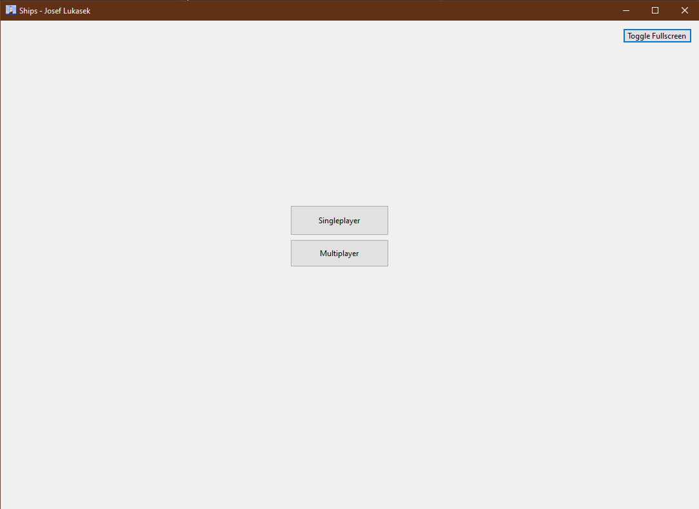
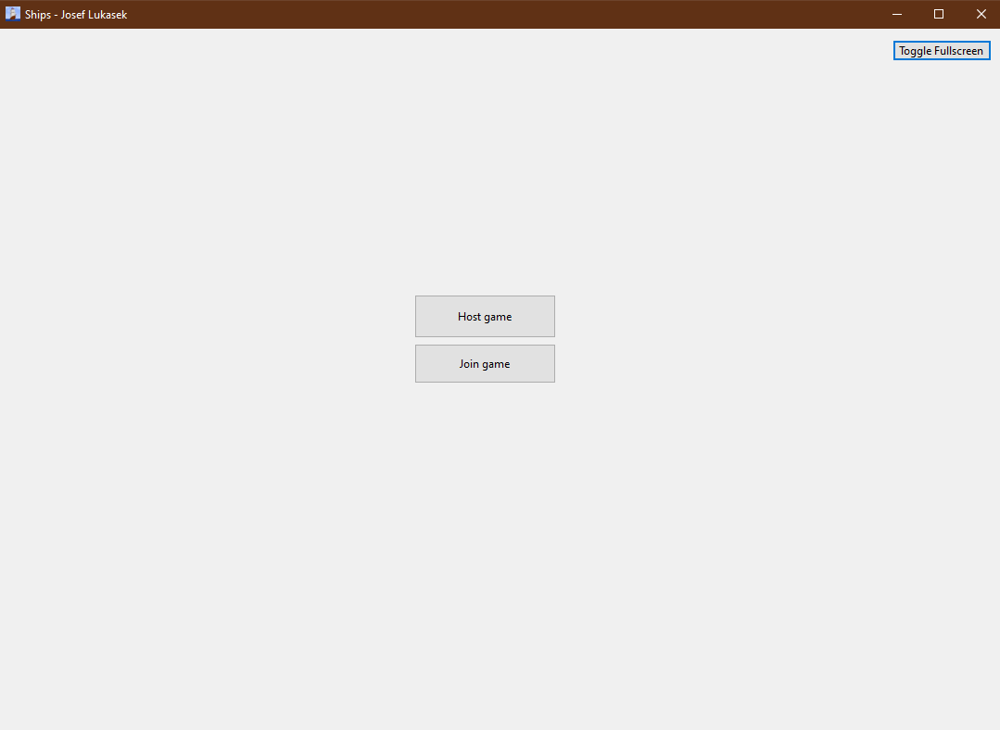
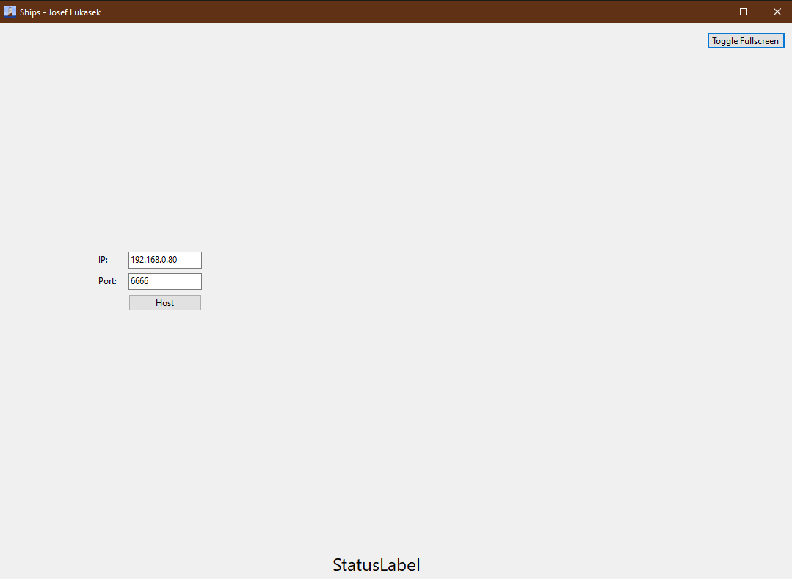
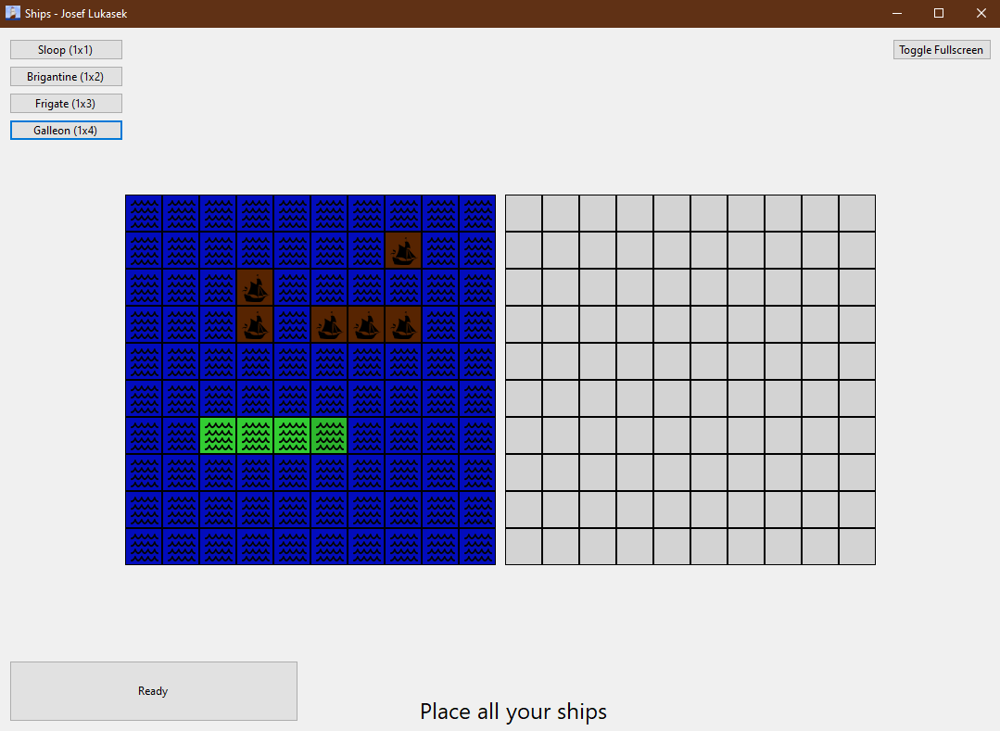
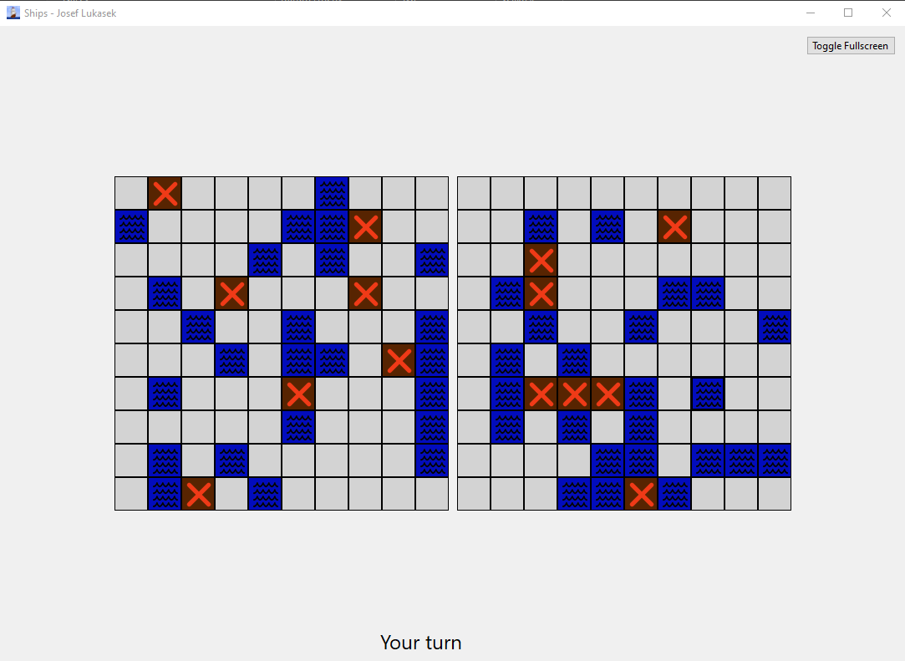
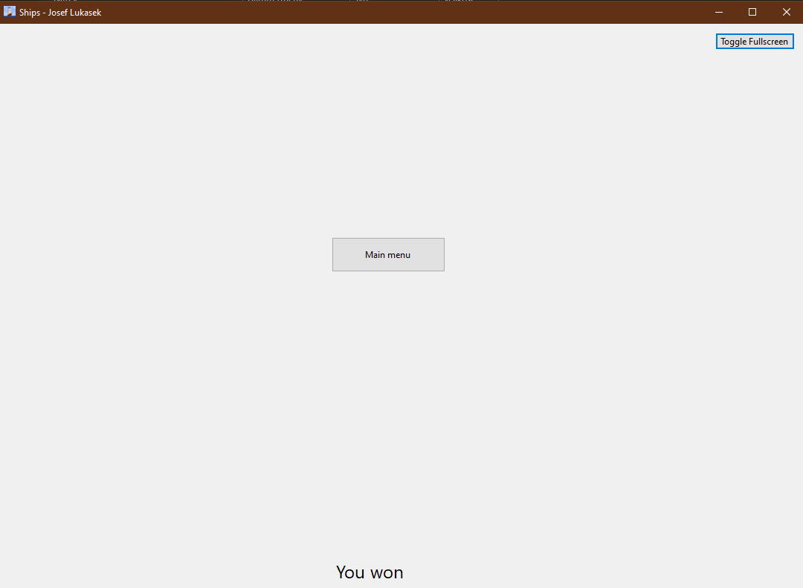

# Ships - Josef Lukášek - User Manual
## Table of Contents
- [Ships - Josef Lukášek - User Manual](#ships---josef-lukášek---user-manual)
  - [Table of Contents](#table-of-contents)
  - [Introduction](#introduction)
  - [Installation](#installation)
  - [Usage](#usage)
  - [Gameplay](#gameplay)
    - [Single-player](#single-player)
  - [Multi-player](#multi-player)

## Introduction
Ships is a simple game based on the classic Battleships game. The game is played on a 10x10 grid, where each player has 10 ships of different sizes. The goal of the game is to sink all of the opponent's ships before they sink yours.

## Installation
The game is written in C# using WinForms library for GUI so you need some tool that is able to compile this project. Visual Studio 2019 or later is recommended for this matter.

The game is compatible with Windows 7 and newer.

To be able to host a multi-player session you also need to open port of your choice in your firewall. The default port is 6666.

## Usage
The game can be played in two modes: single-player and multi-player. In single-player mode you play against a computer. In multi-player mode you can play against another player over the internet.

The game starts with a main menu, where you can choose the game mode.

Single-player option automatically starts a new game against a computer. Multi-player option opens a new window, where you can choose whether you want to host a game or join a game hosted by another player.

If you choose to host a game, you need to enter a port number, which will be used for the connection. The default port is 6666. You also need to enter IP address of your computer. You can find your IP address by typing `ipconfig` in the command line. The IP address is displayed next to the IPv4 Address field.

If you choose to join a game, you need to enter IP address and port number of the host. The host should provide you with this information.

## Gameplay
### Single-player
In single-player mode you play against a computer. The game starts with a player placing their ships on the grid. The player must place the ships manually by clicking on the desired ship button thus selecting the ship and then clicking on the desired position on the grid.
The ship can be rotated by pressing "R" key.
By clicking again on already placed ship, the ship is removed from the grid and can be placed again.

After the player places all of their ships, the game starts by clicking on Ready button. The player can see their ships on the left side of the grid. The player can also see the opponent's ships on the right side of the grid. The player can shoot at the opponent's ships by clicking on the desired position on the grid. The player can see the result of their shot on the right side of the grid. The player can also see the result of the opponent's shot on the left side of the grid.

The game ends when all of the player's ships are sunk or all of the opponent's ships are sunk. The result of the game is displayed in a message box.

## Multi-player
In multi-player mode you play against another player over the LAN. The game is same as in single-player mode, except that players must wait for each other to place their ships and shoot at the opponent's ships. The game ends when all of the player's ships are sunk or all of the opponent's ships are sunk. The result of the game is displayed in a message box.